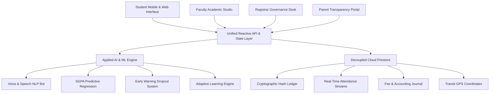

# 📑 SUBMISSION DOCUMENT 03: PROBLEM STATEMENT & PROPOSED SOLUTION
## Breaking Campus Silos: Re-engineering Academic Administration Through AI & Digital Governance

> **Category:** Problem Understanding, Root Cause Analysis & Proposed Architectural Solution  
> **Evaluation Weightage Alignment:** 15% (Problem Understanding) + 20% (Solution Architecture)

---

## 1. Context & Background

Technical colleges and universities across India and globally continue to operate on severely fragmented administrative systems. Over decades of ad-hoc software procurement, individual university departments adopted disconnected point-solutions:
- The registrar's office uses legacy desktop software for admissions;
- Faculty record daily attendance in physical paper register books;
- The finance department runs an isolated fee accounting portal;
- Student grievances are handled on physical sheets or unmonitored email IDs;
- The transport desk coordinates buses via disjointed phone calls and WhatsApp groups;
- Parents remain completely isolated from campus reality until their child is detained or fails.

As a result, **students spend up to 20% of their academic time running from office to office** for routine services like Bonafide certificates, course enrollment, fee receipts, hostel leaves, and attendance calculations.

---

## 2. Deep Problem Statement & Root Cause Analysis

```
┌────────────────────────────────────────────────────────────────────────────────────────┐
│                        ROOT CAUSE MATRIX OF FRAGMENTED CAMPUS SYSTEMS                  │
├────────────────────────────┬─────────────────────────────┬─────────────────────────────┤
│      FRAGMENTED SYMPTOM    │          ROOT CAUSE         │    CATASTROPHIC IMPACT      │
├────────────────────────────┼─────────────────────────────┼─────────────────────────────┤
│ 1. Paper Attendance        │ Manual register calling in  │ 15 mins wasted per class;   │
│    & Proxy Roll-Calls      │ every 50-minute lecture.    │ widespread proxy attendance.│
├────────────────────────────┼─────────────────────────────┼─────────────────────────────┤
│ 2. 3-7 Day Certificate     │ Physical signature routing  │ Missed scholarship deadlines│
│    Delays & Forgery        │ across Clerk, HOD & Dean.   │ (MPTAAS); fake paper certs. │
├────────────────────────────┼─────────────────────────────┼─────────────────────────────┤
│ 3. Surprise Exam           │ Attendance percentages      │ Students detained last-min; │
│    Detention Lists         │ calculated manually at end. │ parental conflict & legal.  │
├────────────────────────────┼─────────────────────────────┼─────────────────────────────┤
│ 4. Silent Student          │ No early warning indicators │ Universities lose 15-20% of │
│    Dropouts                │ for academic distress.      │ enrolled cohort silently.   │
├────────────────────────────┼─────────────────────────────┼─────────────────────────────┤
│ 5. Disjointed Bus Tracking │ No real-time GPS link;      │ Students stranded at stops; │
│    & Safety Vulnerability  │ manual route charts.        │ parental anxiety for safety.│
├────────────────────────────┼─────────────────────────────┼─────────────────────────────┤
│ 6. Inaccessible Parents    │ Only contacted when extreme │ Complete lack of preventive │
│    & Zero Transparency     │ penalty occurs (suspension).│ counseling or support.      │
└────────────────────────────┴─────────────────────────────┴─────────────────────────────┘
```

---

## 3. The Digital Campus Proposed Solution

**Digital Campus** replaces fragmented point-solutions with an **integrated, cloud-native, AI-driven Smart Campus Operating System**.



### Architectural Pillars of the Solution

1. **Unification of 12 Subsystems:**
   Admissions, course registration, attendance radar, dynamic timetables, fees, digital certificates, hostel, transport, grievances, parent portal, AI voice bot, and AI predictive analytics operate on **one single database schema**. An update in one module cascades across the entire platform in real time.
2. **Proactive Over Reactive (AI Engine):**
   Instead of waiting for semester-end failures, the system calculates an **Early Warning Dropout Risk Index** and **Predictive SGPA** in real time, triggering automated counselor and parent interventions 60 days before exams.
3. **Cryptographic Integrity & Instant Service:**
   Students generate tamper-proof **SHA-256 digital certificates** in $< 3$ seconds, with embedded QR codes that any employer or government scholarship agency can verify instantly.
4. **Zero-Paper Statutory Compliance:**
   Automatically audits and enforces institutional mandates: AICTE 75% attendance threshold, 48-hour statutory grievance resolution, and mandatory Anti-Ragging protection.
