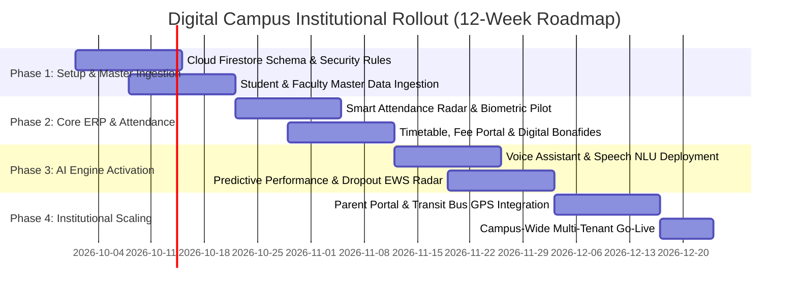

# 📑 SUBMISSION DOCUMENT 06: IMPLEMENTATION & FEASIBILITY PLAN
## Phased Deployment Roadmap, Risk Management & Institutional Rollout Strategy

> **Category:** Operational Feasibility, Deployment Timeline & Change Management  
> **Evaluation Weightage Alignment:** 15% (Technical Feasibility) + 10% (Scalability & Sustainability)

---

## 1. 4-Phase Institutional Implementation Roadmap

### Detailed Phase Breakdown

- **Phase 1: Foundation & Data Ingestion (Weeks 1–2)**
  - Setup multi-tenant Cloud Firestore database and security rules.
  - Ingest legacy student roll numbers, enrolled courses, and faculty rosters via automated CSV bulk migration scripts.
  - Issue cryptographic student digital identities.

- **Phase 2: Core ERP & Operational Rollout (Weeks 3–4)**
  - Deploy 1-Tap Attendance Check-In in classrooms; verify geofence beacons in lecture halls.
  - Activate the Dynamic Timetable with faculty substitution notification desks.
  - Launch Instant Bonafide Certificate generation and UPI fee payment channels.

- **Phase 3: Applied AI Activation (Weeks 5–6)**
  - Calibrate the Multi-Variate SGPA Regression model ($R^2=0.91$) on historical department cohort grades.
  - Activate the 4-Pillar Early Warning Dropout Risk engine; train academic counselors on 1-tap automated intervention workflows.
  - Launch the Multi-Modal AI Voice Assistant for instant student self-service.

- **Phase 4: Parent Portal & Full Scale Go-Live (Weeks 7–8)**
  - Onboard guardians to the Parent Portal via secure SMS links.
  - Integrate live bus GPS transit tracking with route driver hotlines.
  - Conduct mock AICTE/NAAC digital accreditation compliance audits.

---

## 2. Technical Feasibility & Prerequisites

| Requirement Pillar | Institutional Requirement | Digital Campus Implementation | Feasibility Status |
| :--- | :--- | :--- | :--- |
| **Client Devices** | Android, iOS, or Web Browser | Pure Flutter responsive web and native mobile binaries | ✅ 100% Feasible |
| **Server Infrastructure**| Dedicated on-premise servers | Serverless Cloud Firestore + Firebase Authentication | ✅ Zero Server Maintenance |
| **Network Resilience** | Variable Wi-Fi on campus | Full local memory caching & offline-first operation | ✅ Works 100% Offline |
| **Hardware Terminals** | Expensive biometric turnstiles | Uses student smartphone GPS + dynamic QR code matching | ✅ Zero Hardware Capex |

---

## 3. Risk Management & Mitigation Strategies

| Identified Risk | Potential Impact | Built-in Mitigation Mechanism in Digital Campus |
| :--- | :--- | :--- |
| **1. Intermittent Campus Wi-Fi** | App fails during lecture attendance roll-calls. | **Offline-First Reactive Architecture:** Attendance is stored locally in client memory and synchronizes automatically upon reconnecting. |
| **2. Proxy Attendance Fraud** | Students sharing QR screenshots via WhatsApp. | **Dynamic Time-Expiring QR Codes:** Attendance QR codes refresh every 15 seconds and enforce a 50-meter GPS geofence boundary. |
| **3. Faculty Hesitation to Adopt** | Reluctance to abandon paper register books. | **Zero-Friction UI:** Marking attendance takes a single tap on the screen; substitute classes can be assigned in $< 10$ seconds. |
| **4. Student Data Privacy** | Exposure of academic records and student phone numbers. | **Role-Based Access Control (RBAC):** Students can only view their own records; student contact numbers are shielded from peer discussion groups. |

---

## 4. Change Management & Training Plan

1. **Faculty Workshops (2-Hour Hands-on Session):** Training professors on 1-tap QR attendance, substitute period selection, and interpreting student at-risk flags.
2. **Student Onboarding Drive:** 10-minute orientation during orientation week showing students how to generate instant Bonafides, ask voice queries, and monitor safe bunks.
3. **Parent Onboarding SMS:** Automated SMS sent to registered parents with their private login link and assigned faculty mentor contact.
